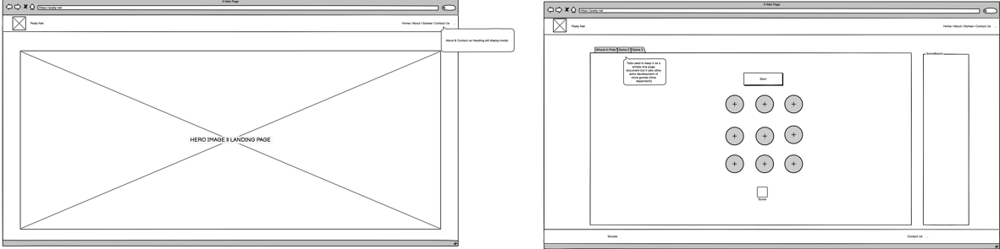
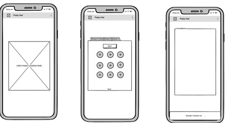

# Pasty-Net

1. Homepage with a Cornish Theme
   User Story:
   As a visitor, I want to see a welcoming homepage with a Cornish theme, so that I immediately feel immersed in the culture and style of Cornwall.

Acceptance Criteria:

The homepage should have a Cornish-inspired design (e.g., colors, imagery, typography).
A brief welcome message about Cornwall is displayed.
A clear call-to-action (e.g., "Play the Game") is present.
Tasks:
✅ Design and implement homepage layout.
✅ Add a Cornish-themed background and images.
✅ Write and display a short introduction to Cornwall.

2. Simple Navigation Menu
   User Story:
   As a user, I want to browse a simple navigation menu, so that I can easily find different sections of the website.

Acceptance Criteria:

The menu should include links to Home, Game, Leaderboard, and About.
The menu should be accessible from all pages.
Links should be visually distinct and easy to click.
Tasks:
✅ Design and implement the navigation bar.
✅ Ensure menu links work correctly.
✅ Apply responsive design for mobile and desktop views.

3. Cornwall Introduction Page
   User Story:
   As a visitor, I want to read a short introduction about Cornwall and its culture, so that I understand the theme of the website.

Acceptance Criteria:

A page titled “About Cornwall” exists.
The page includes a short history of Cornwall, its traditions, and famous foods.
At least one image representing Cornwall is included.
Tasks:
✅ Create an "About Cornwall" page.
✅ Write content about Cornwall’s history, culture, and food.
✅ Add relevant images with alt text for accessibility.

4. Playable Whack-a-Mole-Style Game
   User Story:
   As a user, I want to play a Cornish-themed version of Whack-a-Mole, so that I can enjoy a fun and interactive experience.

Acceptance Criteria:

The game starts when the user clicks “Play.”
Cornwall-themed “moles” (e.g., smugglers, piskies, seagulls) pop up randomly.
The user can click/tap to "whack" the characters.
A score counter increases with each successful hit.
Tasks:
✅ Develop game mechanics using JavaScript.
✅ Design and animate Cornwall-themed characters.
✅ Implement score tracking.

5. High Score Saving
   User Story:
   As a returning player, I want my high scores to be saved, so that I can try to beat my previous record.

Acceptance Criteria:

The game saves the highest score achieved by the user in local storage.
When the game starts, the highest score is displayed.
Tasks:
✅ Implement local storage to save high scores.
✅ Display the high score on the game screen.
✅ Add a reset button to clear high scores if needed.

6. Themed Game Characters
   User Story:
   As a player, I want to “whack” Cornish-themed characters (e.g., smugglers, piskies, or seagulls stealing pasties), so that the game feels unique and fun.

Acceptance Criteria:

The game features at least 3 different Cornish characters.
Each character has a unique animation when hit.
Character appearances are randomized.
Tasks:
✅ Design and animate Cornish-themed characters.
✅ Assign different sound effects to each character.
✅ Ensure randomness in character appearances.

7. Score Counter & Timer
   User Story:
   As a player, I want a timer and score counter displayed during the game, so that I can track my progress and compete for a high score.

Acceptance Criteria:

A visible timer counts down from 60 seconds.
The score increases with each successful hit.
When the timer reaches zero, the game ends and displays the final score.
Tasks:
✅ Implement a countdown timer.
✅ Update and display the score as the player hits targets.
✅ Show a game-over screen when time runs out.

8. Increasing Difficulty Levels
   User Story:
   As a player, I want increasing difficulty levels, so that the game becomes more challenging and exciting the longer I play.

Acceptance Criteria:

The speed of character appearances increases as the game progresses.
More characters appear at once after a set time.
Difficulty resets when a new game starts.
Tasks:
✅ Adjust game logic to increase difficulty over time.
✅ Balance game mechanics to maintain fairness.
✅ Test difficulty progression at different levels.

9. Sound Effects & Feedback
   User Story:
   As a player, I want fun Cornish sound effects (e.g., seagull squawks, “Proper Job!” voice clips), so that the game feels lively and engaging.

Acceptance Criteria:

A different sound effect plays for each character hit.
Background music enhances gameplay but can be muted.
A visual effect (e.g., flash or shake) appears when a character is hit.
Tasks:
✅ Select and add appropriate Cornish-themed sounds.
✅ Implement an on/off toggle for sound settings.
✅ Add a small animation or visual cue on successful hits.

10. Leaderboard for Top Scores
    User Story:
    As a competitive user, I want a leaderboard showcasing the top scores, so that I can compete with other players.

Acceptance Criteria:

The top 5 highest scores are displayed on a leaderboard page.
The leaderboard updates in real time.
The player's name or initials can be entered for high scores.
Tasks:
✅ Design and implement the leaderboard UI.
✅ Store and update scores in local storage or a database.
✅ Create a form for players to enter their name when they get a high score.

# Wireframes:

<<<<<<< HEAD
## Snek2048

In Snek2048, you control a snake that moves around the game board. The goal is to collect fruits that appear randomly on the board. Each fruit you collect increases the snake's length and the players score. The game ends if the snake collides with the walls or itself.

### Features

- The Game is responsive and will resize to fit any screen size while maintaining the aspect ratio.
- It can be controlled with WASD or the arrow keys.
- It can also be controlled with the touchscreen.
- There is a fullscreen mode which can be initiated with either a button or a keyboard shortcut.
- There is background music and sound effects.
- There is a title screen and game over screen.

### Known Issues & Limitations

- The animated title doesn't work since a module is required to display animated gifs within a canvas
- There is no highscore recorded
- No local storage to save scores
- Collision is buggy and the snake will go slightly offscreen
- fruit placement is buggy and will go slightly offscreen

### Future Features

Here are some potential features that could be added to enhance the Snek2048 game:

1. **Multiple Levels**:

   - Introduce different levels with increasing difficulty.
   - Each level could have unique challenges, such as obstacles or faster-moving fruits.

2. **Power-Ups**:

   - Add power-ups that provide temporary benefits, such as increased speed, invincibility, or the ability to pass through walls.
   - Power-ups could appear randomly on the game board and be collected by the snake.

3. **Achievements and Leaderboards**:

   - Add a system of achievements that players can unlock by completing specific tasks or reaching milestones.
   - Implement a global leaderboard to showcase the top scores and allow players to compete for the highest rank.

4. **Enhanced Graphics and Animations**:

   - Improve the visual quality of the game with enhanced graphics and smoother animations.
   - Add special effects for actions such as collecting fruits, growing the snake, and game over events.

5. **Tutorial and Help Section**:
   - Add a tutorial mode to guide new players through the basics of the game.
   - Include a help section with detailed explanations of game mechanics, controls, and power-ups.

These features would enhance the gameplay experience, provide more variety and challenges, and make Snek2048 even more engaging for players.
=======
## Page Layout

The overall page layout of Pasty Net is designed to provide a seamless and engaging user experience, with a focus on responsiveness and ease of navigation. The layout is structured into several key sections: the navigation bar, the hero section, and the main content area with tabs containing the game content.

### Navigation Bar

The navigation bar is fixed at the top of the page and provides easy access to different sections of the website. It includes links to the "Games" section, the "About" section, and a "Contact Us" link that triggers an off-canvas contact form. The navigation bar also displays the total score accumulated across all games, providing users with a quick overview of their progress.

### Hero Section

The hero section is a visually striking area at the top of the page, featuring a carousel of images that showcase the beauty of Cornwall. This section includes a welcoming message and a call-to-action button that directs users to the game section. The hero section is designed to capture the user's attention and set the tone for the rest of the website.

### Bootstrap Tabs - Main Content

The main content area is organized into tabs, each containing a different game or informational content. The tabs are implemented using Bootstrap's tab component, ensuring a responsive and user-friendly interface. The tabs include:

About: Provides an introduction to Pasty Net and its Cornish-themed games.
Whack-a-Mole: A fun and interactive game where users can whack moles to score points.
Combo: A game where users create portmanteau words by combining answers to questions and images.
Snake: A classic snake game with a Cornish twist.
Hangman: A traditional hangman game with Cornish-themed words and phrases.

#### Navigation and Random Game Selection

The navigation bar includes a link to the "Games" section that incorporates JavaScript to select a game at random. When the user clicks the "Games" link, the JavaScript code randomly selects one of the game tabs and activates it, providing a dynamic and engaging experience.

#### Separate and Total Scores

Each game has its own separate score, which is displayed within the respective game tab. Additionally, the total score across all games is displayed in the navigation bar, allowing users to track their overall progress. The scores are updated in real-time, ensuring that users always have the most up-to-date information.

#### Contact Form

The website includes a contact form that is accessible via an off-canvas component. The form allows users to enter their name, email address, and a message. This form is designed to be simple and user-friendly, providing an easy way for users to get in touch with the website administrators.

#### Responsiveness

The entire layout of Pasty Net is designed with responsiveness in mind. Bootstrap's utility classes and components are used extensively to ensure that the website looks and functions well on a variety of devices and screen sizes. The hero section, navigation bar, and game tabs all adapt to different screen sizes, providing a consistent and enjoyable experience for users on desktops, tablets, and mobile devices.

### Summary

The page layout of Pasty Net is carefully designed to provide a seamless and engaging user experience. The navigation bar, hero section, and tabbed content areas are all implemented with responsiveness and ease of navigation in mind. The inclusion of separate and total scores for the games, along with a user-friendly contact form, ensures that users can easily track their progress and get in touch with the website administrators. The use of JavaScript to select a random game adds an element of surprise and excitement, making Pasty Net a fun and interactive website for users of all ages.

## Whack a Mole

The Whack-a-Mole game on Pasty Net is a fun and interactive experience designed to keep users entertained. The game is built using Bootstrap for the layout and styling, ensuring a responsive and visually appealing interface. The game area is designed with a grid layout where moles pop up randomly, and users can click or tap on them to score points. The game incorporates various Bootstrap components to enhance the user experience. The use of Bootstrap's utility classes ensures that the game is responsive and works well on different screen sizes, providing a consistent experience across devices.

The JavaScript game loop is the core of the Whack-a-Mole game, managing the timing and logic of mole appearances and user interactions. The game loop uses setInterval to control the frequency of mole appearances, and event listeners to handle user clicks on the moles. When a mole is clicked, the game logic updates the score and provides visual feedback to the user. The game loop also includes a timer that counts down from 60 seconds, and the game ends when the timer reaches zero. The game logic ensures that the difficulty increases as the game progresses, with moles appearing more frequently and in greater numbers.

### Stages of Development

The development of the Whack-a-Mole game followed a structured approach, starting with a working outline and gradually adding more features and enhancements. The initial stage involved creating a basic game loop and layout using HTML, CSS, and JavaScript. This working outline provided a foundation for further development, allowing the team to test and refine the core game mechanics. Once the basic functionality was in place, the focus shifted to enhancing the user experience by incorporating AI-generated images and sound effects. These assets were carefully selected to match the Cornish theme of the game, adding an extra layer of immersion and enjoyment for the players.

Throughout the development process, the team used Bootstrap to ensure a responsive and visually appealing design. The integration of AI-generated images and sound effects added a unique touch to the game, making it more engaging and enjoyable. The final stage of development involved thorough testing and optimization to ensure that the game ran smoothly on different devices and screen sizes. By following a structured development process and incorporating feedback from testers, the team was able to create a polished and entertaining Whack-a-Mole game that users can enjoy on Pasty Net.
>>>>>>> origin/feature-branch

## Cornish Combination

Cornish Combination is a portmanteau creating game, based on the _Answer Smash_ round of BBC's _Richard Osman's House of Games_. The player is displayed a question and an image; the last letters of the answer to the question will be the same as the first letters of what is depicted in the image. The player must combine these two words or phrases, overlapping the matching letters, and make a new word or phrase that is a portmanteau of the two. The player has three attempts to get it right before being given the solution and a button to continue to the next question. A score of correct answers is displayed.

### Accessibility

Each image has alt text that does not simply state what the image is as it would give away the answer, so the alt text is descriptive and can effectively be used as a second text question.

### Known Issues

- The game only has three questions and loops indefinitely, therefore the player can gain infinite points after learning the correct answers
- The enter key cannot be used to replace clicking the Next Question button
- The game is not case sensitive but the answer must be an exact match otherwise, with no room for error such as missing "A"s and "The"s

### Roadmap

If work were to continue on the project, the following features would be considered:

- Place the questions in an external file accessed by JavaScript - they are currently in the JS file
- The game would compare strings and create puzzles dynamically from a large selection of questions and images that share starting and ending letters
- The questions would be randomised
- There would be a way to have close enough but not quite matching answers be accepted
- The game would have flashier styling and animations

## Screenshots

### Snek2048 Screenshots

## Credits

### Media

- Botanical garden tourist attraction from [Wikimedia](https://commons.wikimedia.org/wiki/File:Eden_project.JPG) - public domain
- Baked pastry from [Wikimedia](https://commons.wikimedia.org/wiki/File:Cornish_pasty.jpeg) - licensed under the Creative Commons Attribution-Share Alike 2.0 UK: England & Wales license
- Red-beaked corvid from [Wikimedia](<https://commons.wikimedia.org/wiki/File:Red-billed_chough_(Pyrrhocorax_pyrrhocorax).jpg>) - public domain
